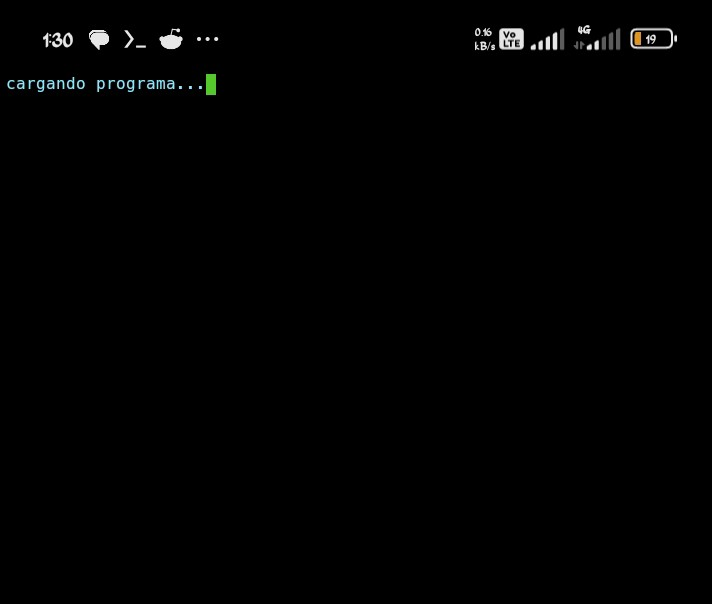
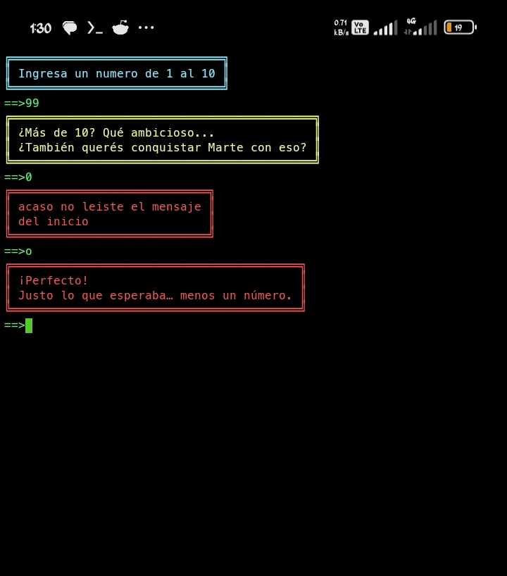
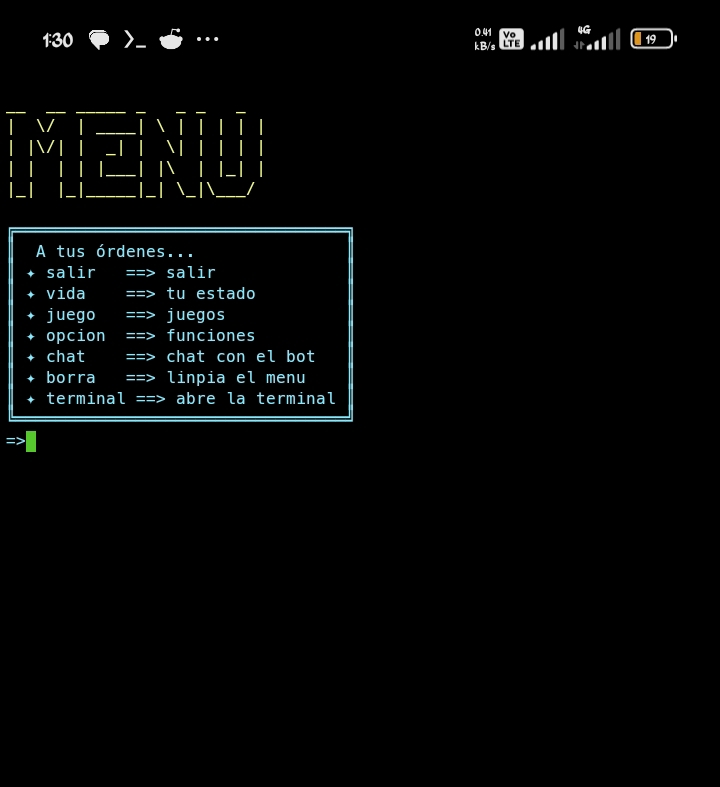

# Emulador Terminal Integrasion

este es mi proyecto donde meto todo lo que voy aprendiendo de python  
arrancó como un script simple con piedra papel tijera y vidas este proyecto va evolucionando a medida que aprendo

es una terminal con menú, juegos, matemáticas, un chatbot que todavía estoy armando y tambien es una asistente que te ayuda y proporciona informacion del proyecto ("Bueno eso estoy queriendo que haga jeje:)")

## capturas para que veas cómo se ve

### pantalla de carga
<p align="center">
  
</p>

### elección de vida
<p align="center">
  
</p>

### menú principal
<p align="center">
  
</p>

## qué tiene ahora
- menú con comandos: salir, vida (tu estado), juego (juegos), opcion (funciones), chat, borra (limpia pantalla), terminal (abre otra consola)
- vida que se guarda y tiene barra visual
- juegos: adivina el número, piedra papel tijera
- matemáticas: cálculo simple, diámetro, interés compuesto...
- chatbot básico (responde saludos y cosas simples)
- config  (version.json)
- validaciones cuando te equivocás (mensajes claros)
- animaciones de carga y cuadros con color

## cómo correrlo
1. cloná el repo
2.
```
   git clone https://github.com/jorge2599/Emulador-terminal-integrasion.git  
   cd Emulador-terminal-integrasion
```

2. instalá colorama (lo único que necesita)  
```
   pip install colorama
```

3. dale play  
```
   python main.py
```

## estructura de carpetas
```
Emulador-terminal-integrasion/
│
├── Matematicas/
│   ├── Matematica_ interes_compuesto.py
│   ├── Matematica_calculo_simple.py
│   ├── Matematica_diametro.py
│   ├── matematica.py
│   └── Menu_UI_matematica.py
│
│
│
├── assets/
│   ├── inicio.png
│   ├── vida.png
│   └── Menu.png
│
│               
├── chatbot/
│   ├── animaciones_del_bot/
│   │   └──animacion_escritura_bot.py
│   └── Chat_bot.py
│   
├── config/
│   ├── chat_bot_confing/
│   │   └── Bot_confing.py
│   │ 
│   ├── confing_ui/
│   │   ├──json_confing_UI.py
│   │   ├──UI_Chatbot.py
│   │   ├──UI_Juegos.py
│   │   ├──UI_lista.py
│   │   ├──UI_mate.py
│   │   └──UI_utils.py
│   │   
│   ├── Juego_config/
│   │   └──Confing_Juego.py
│   └── confing.py
│
├──dato_info_txt/
│   ├──chat_bot_json/
│   │   ├──clave.json
│   │   └──Dialogo.json
│   ├──Juego_json/
│   │   └──Juego_Dialogo.json
│   ├──UI_Clave_json/
│   │   └──Clave_dato_Comando.json
│   ├──versionado_json/
│   └──   └──version.json
│   
│  
├── UI/
│   └──UI_pricipal.py
│
├── juegos/
│   ├── Adivina_el_numero.py
│   └── Piedra_Papel_Tijera.py
│
├── utilidades/
│   ├── calendario.py
│   ├── limpia_terminal.py
│   ├── Carga.py
│   ├── Comando.py
│   ├── Cuadro.py
│   ├── Verificar_Vida.py
│   └── Vida.py
│
│
├── LICENSE
│
│
├── README.MD
│
│
└── main.py
```

## Nuevas mejoras
He implementado nuevas mejoras en el código. Optimicé los imports de la UI principal y agregué nuevos paquetes y módulos, asignando a cada uno una única responsabilidad.
En el paquete de matemática, incorporé un nuevo módulo que se encarga exclusivamente de gestionar los menús matemáticos.
En utilidades, añadí un módulo de fecha cuya función es organizar y registrar el orden, la fecha y la hora de ejecución de cada parte del proyecto.
Además, creé un paquete específico para las animaciones del bot, destinado a contener únicamente las animaciones exclusivas del chatbot.

## mejoras que hice 18/1/26 
He hecho algunas correcciones a bugs y algunas partes de mi codigo que faltaba eh separado cada cosa en diferentes paquetes con su respectivo nombre de a que modulo pertece pero la diferencia ahora es que estan ubicados en un solo paqueque los que tienen un solo funcionamiento, todo los encargados de configuracion estan en config, los json en dato_info_txt con un sud carpeta con el nombre para idectificar a que modulo y paquete pertenece ese json, la configuracion de UI_pricipal lo movi en config como mensione antes estan con su respectivo nombre para que sea facil de idectificar, con estas modificasiones busco centralizar todas las cosas con el mismo proposito en un solo paquete para una modificasiones mas eficientes y rapidas y una busqueda de errores mas facil


## próximas cosas que  voy a hacer o mejorar y agregrar 
- mejorar el chat con más respuestas y lógica
- Agregar un registro de usuario
- menu de informacion basica segun el inicio de sesion
- nuevas animaciones
- agregar logs de lo que hacés
- quizás un descargador de yt
- más juegos y y funciones
- algún día probar pygame
- 

es mi lugar para practicar, así que va cambiando cada vez que aprendo algo nuevo.